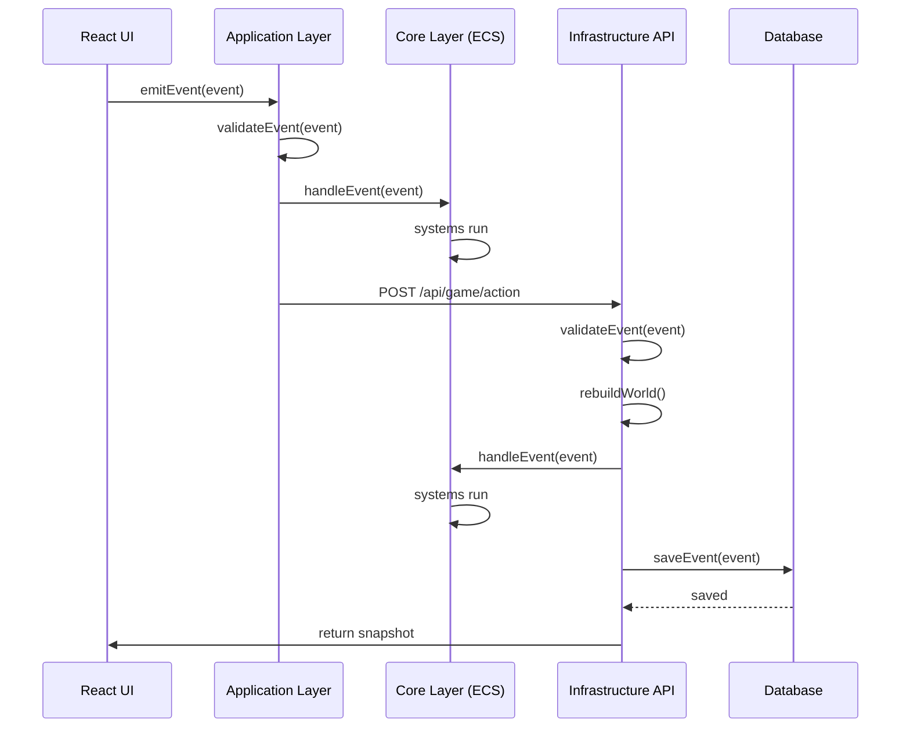

# Масштабируемая архитектура для ECS Idle-игры

## Архитектурные слои

```
┌─────────────────────────────────────────────────────────────┐
│                  Presentation Layer                         │
│                      (Frontend)                              │
│  React UI, State Management, Optimistic Updates            │
└─────────────────────────────────────────────────────────────┘
                          ↓ Events/Actions
┌─────────────────────────────────────────────────────────────┐
│                   Application Layer                         │
│              (Business Logic & Validation)                   │
│  - Event Handlers (emit-start-expedition, etc.)            │
│  - Event Validation                                         │
│  - Business Rules                                           │
└─────────────────────────────────────────────────────────────┘
                          ↓ Apply Events
┌─────────────────────────────────────────────────────────────┐
│                      Core Layer                             │
│                   (ECS Engine)                              │
│  - Components (pure data)                                   │
│  - Systems (pure logic)                                     │
│  - Game Loop (deterministic simulation)                     │
│  - World State                                              │
└─────────────────────────────────────────────────────────────┘
                          ↓ Persistence
┌─────────────────────────────────────────────────────────────┐
│                 Infrastructure Layer                        │
│             (Backend & Data Storage)                       │
│  - Hono API Routes                                          │
│  - Prisma ORM + SQLite                                      │
│  - Event Store (Event Sourcing)                             │
│  - WebSocket (real-time)                                    │
└─────────────────────────────────────────────────────────────┘
```

## Слой 1: Core Layer (ECS Engine)

### Ответственность

- Чистая ECS-логика без зависимостей от внешнего мира
- Deterministic simulation
- Type-safe components и systems

### Структура

```
src/core/
├── components/          # Component definitions (pure data)
│   ├── user-component.ts
│   ├── resource-component.ts
│   ├── extraction-station-component.ts
│   ├── upgrade-definition-component.ts
│   └── ...
├── systems/             # System implementations (pure logic)
│   ├── production-system.ts
│   ├── purchase-upgrade-system.ts
│   ├── expedition-system.ts
│   └── ...
├── events/              # Event emitters (application layer interface)
│   ├── emit-start-expedition.ts
│   ├── emit-build-station.ts
│   └── ...
├── singletons/          # Global state
│   └── time-singleton.ts
├── lib/
│   ├── world-utils.ts   # createWorld, createEntity
│   ├── component-utils.ts # createComponent, addComponent
│   ├── query.ts         # Query builders
│   └── singleton-utils.ts
├── types.ts             # Core types
└── game-loop.ts         # Fixed timestep simulation
```

### Принципы

- ❌ Нет Date.now(), Math.random(), fetch
- ❌ Нет бизнес-логики в components
- ✅ Components = только данные
- ✅ Systems = только чистые функции (world, deltaMs) => void
- ✅ Isomorphic: используется и на FE, и на BE

## Слой 2: Event Layer

### Ответственность

- Определение типов событий пользователя (events)
- Сериализация/десериализация событий
- Event sourcing (сохранение истории)

### Типы событий

```typescript
// src/events/types.ts
export type GameEvent =
  | BuildStationEvent
  | SellResourceEvent
  | StartExpeditionEvent
  | MarketListingEvent
  | MarketPurchaseEvent
  | RoguelikeStartRunEvent;

export type BuildStationEvent = {
  type: "BUILD_STATION";
  userId: string;
  stationType: string;
  timestamp: number;
};

export type SellResourceEvent = {
  type: "SELL_RESOURCE";
  userId: string;
  resourceType: ResourceType;
  amount: number;
  price: number;
  timestamp: number;
};

export type StartExpeditionEvent = {
  type: "START_EXPEDITION";
  userId: string;
  target: string;
  timestamp: number;
};
```

### Event Store (Infrastructure)

```typescript
// src/infrastructure/event-store.ts
export type EventStore = {
  append(userId: string, events: GameEvent[]): Promise<void>;
  getEvents(userId: string, from?: number, to?: number): Promise<GameEvent[]>;
  getEventsBefore(userId: string, timestamp: number): Promise<GameEvent[]>;
};
```

## Слой 3: Application Layer

### Ответственность

- Бизнес-логика и валидация событий
- Преобразование событий в компоненты (через systems)
- Business rules (правила игры)

### Структура

```
src/application/
├── validators/         # Event validation logic
│   ├── validate-build-station.ts
│   ├── validate-sell-resource.ts
│   └── validate-expedition.ts
├── handlers/           # Apply events to world
│   ├── handle-build-station.ts
│   ├── handle-sell-resource.ts
│   └── handle-expedition.ts
└── services/           # Application services
    ├── event-validator.service.ts
    ├── world-builder.service.ts
    └── offline-progress.service.ts
```

### Пример валидатора

```typescript
// src/application/validators/validate-build-station.ts
import type {World} from "~/core/types";
import type {BuildStationEvent} from "~/events/types";
import {query} from "~/core/lib/query";
import {ResourceComponent, OwnedByComponent} from "~/core/components";

export type ValidationResult = {valid: true} | {valid: false; reason: string};

export function validateBuildStation(world: World, event: BuildStationEvent): ValidationResult {
  // Проверяем существование пользователя
  const userExists = checkUserExists(world, event.userId);
  if (!userExists) {
    return {valid: false, reason: "USER_NOT_FOUND"};
  }

  // Проверяем наличие ресурсов
  const stationCost = getStationCost(event.stationType);
  for (const [type, cost] of Object.entries(stationCost)) {
    const hasResource = checkUserResource(world, event.userId, type, cost);
    if (!hasResource) {
      return {valid: false, reason: "INSUFFICIENT_RESOURCES"};
    }
  }

  return {valid: true};
}
```

### Пример обработчика

```typescript
// src/application/handlers/handle-build-station.ts
import type {World} from "~/core/types";
import type {BuildStationEvent} from "~/events/types";
import {addComponent, createEntity} from "~/core/lib/world-utils";
import {
  ExtractionStationComponent,
  ResourceGeneratorComponent,
  OwnedByComponent,
} from "~/core/components";

export function handleBuildStation(world: World, event: BuildStationEvent): void {
  const stationEntity = createEntity();

  // Добавляем компоненты станции
  addComponent(world, ExtractionStationComponent, stationEntity, {
    type: event.stationType,
    level: 1,
  });

  addComponent(world, ResourceGeneratorComponent, stationEntity, {
    resource: getStationResource(event.stationType),
    ratePerSecond: getStationRate(event.stationType),
  });

  addComponent(world, OwnedByComponent, stationEntity, {
    owner: getUserIdEntity(world, event.userId),
  });
}
```

## Слой 4: Infrastructure Layer

### Ответственность

- API endpoints (Hono)
- Database access (Prisma + SQLite)
- Real-time communication (WebSocket)
- Authentication & Authorization

### Структура

```
src/infrastructure/
├── api/
│   ├── routes/
│   │   ├── game.ts           # /api/game (player actions)
│   │   ├── market.ts         # /api/market (market operations)
│   │   ├── roguelike.ts      # /api/roguelike (run management)
│   │   └── websocket.ts      # WebSocket endpoint
│   ├── middleware/
│   │   ├── auth.ts           # JWT validation
│   │   └── ratelimit.ts      # Rate limiting
│   └── index.ts
├── database/
│   ├── prisma/
│   │   └── schema.prisma     # Prisma schema
│   ├── event-store.ts        # Event persistence
│   └── repositories/
│       ├── user.repository.ts
│       ├── event.repository.ts
│       └── market.repository.ts
├── services/
│   ├── event-validator.service.ts
│   ├── world-builder.service.ts
│   ├── offline-progress.service.ts
│   └── conflict-resolution.service.ts
└── server.ts                # Hono server entry point
```

### Prisma Schema

```prisma
// src/infrastructure/database/prisma/schema.prisma

generator client {
  provider = "prisma-client-js"
}

datasource db {
  provider = "sqlite"
  url      = env("DATABASE_URL")
}

model User {
  id          String   @id @default(uuid())
  createdAt   Int      @default(0)
  lastActive  Int      @default(0)
  events      Event[]
  marketListings MarketListing[]
  roguelikeRuns RoguelikeRun[]
}

model Event {
  id        Int      @id @default(autoincrement())
  userId    String
  eventData String   // JSON string
  timestamp Int
  version   Int
  user      User     @relation(fields: [userId], references: [id])

  @@index([userId, timestamp])
  @@index([timestamp])
}

model MarketListing {
  id            String   @id @default(uuid())
  sellerUserId  String
  resourceType  String
  amount        Int
  pricePerUnit  Int
  createdAt     Int
  expiresAt     Int
  status        String   // 'active' | 'completed' | 'expired' | 'cancelled'
  seller        User     @relation(fields: [sellerUserId], references: [id])

  @@index([status, expiresAt])
}

model RoguelikeRun {
  id          String   @id @default(uuid())
  userId      String
  seed        Int
  startedAt   Int
  completedAt Int?
  floor       Int      @default(1)
  state       String   // 'active' | 'completed' | 'failed'
  runData     String?  // JSON string
  user        User     @relation(fields: [userId], references: [id])
}
```

### API Route Example

```typescript
// src/infrastructure/api/routes/game.ts
import {Hono} from "hono";
import {z} from "zod";
import {PrismaClient} from "@prisma/client";
import {validateBuildStation} from "~/application/validators";
import {handleBuildStation} from "~/application/handlers";
import {createWorld} from "~/core/lib/world-utils";
import {registerComponents} from "~/core/bootstrap";

const gameRouter = new Hono();
const prisma = new PrismaClient();

const buildStationSchema = z.object({
  stationType: z.string(),
});

// POST /api/game/build-station
gameRouter.post("/build-station", async (c) => {
  const userId = c.get("userId");
  const body = await c.req.json();

  // Валидация payload
  const parsed = buildStationSchema.safeParse(body);
  if (!parsed.success) {
    return c.json({error: "INVALID_PAYLOAD", details: parsed.error}, 400);
  }

  const event: BuildStationEvent = {
    type: "BUILD_STATION",
    userId,
    stationType: parsed.data.stationType,
    timestamp: Date.now(),
  };

  // Восстанавливаем world из событий
  const events = await prisma.event.findMany({
    where: {userId},
    orderBy: {timestamp: "asc"},
  });
  const world = rebuildWorld(events.map((e) => JSON.parse(e.eventData)));

  // Валидация
  const validation = validateBuildStation(world, event);
  if (!validation.valid) {
    return c.json({error: validation.reason}, 400);
  }

  // Применяем событие
  handleBuildStation(world, event);

  // Сохраняем событие
  await prisma.event.create({
    data: {
      userId,
      eventData: JSON.stringify(event),
      timestamp: event.timestamp,
      version: events.length + 1,
    },
  });

  // Обновляем lastActive
  await prisma.user.update({
    where: {id: userId},
    data: {lastActive: Date.now()},
  });

  // Возвращаем snapshot
  return c.json({
    event,
    snapshot: createSnapshot(world),
  });
});

// GET /api/game/state
gameRouter.get("/state", async (c) => {
  const userId = c.get("userId");

  const events = await prisma.event.findMany({
    where: {userId},
    orderBy: {timestamp: "asc"},
  });

  const world = rebuildWorld(events.map((e) => JSON.parse(e.eventData)));

  return c.json({
    snapshot: createSnapshot(world),
  });
});

export {gameRouter};
```

## Слой 5: Presentation Layer

### Ответственность

- React UI
- State management
- Optimistic updates
- Real-time updates (WebSocket)

### Структура (TBD)

```
src/frontend/
├── components/         # React components
│   ├── resources/
│   ├── stations/
│   ├── market/
│   └── roguelike/
├── hooks/              # Custom hooks
│   ├── useGameState.ts
│   ├── useEventEmitter.ts
│   └── useWebSocket.ts
├── services/
│   ├── api.service.ts  # HTTP client
│   └── websocket.service.ts
├── stores/             # State management
│   └── game.store.ts
└── App.tsx
```

### Пример хука

```typescript
// src/frontend/hooks/useGameState.ts
import {useEffect, useState} from "react";
import type {GameEvent} from "~/events/types";
import type {WorldSnapshot} from "~/snapshots";

export function useGameState(userId: string) {
  const [snapshot, setSnapshot] = useState<WorldSnapshot | null>(null);
  const [isLoading, setIsLoading] = useState(true);
  const [error, setError] = useState<string | null>(null);

  useEffect(() => {
    fetchGameState(userId);
  }, [userId]);

  async function fetchGameState(userId: string) {
    try {
      const response = await fetch(`/api/game/state?userId=${userId}`);
      const data = await response.json();
      setSnapshot(data.snapshot);
    } catch (e) {
      setError(e instanceof Error ? e.message : "Unknown error");
    } finally {
      setIsLoading(false);
    }
  }

  async function emitEvent(event: GameEvent) {
    // Optimistic update
    const optimisticResult = applyEventOptimistically(snapshot, event);
    setSnapshot(optimisticResult);

    try {
      const response = await fetch("/api/game/emit", {
        method: "POST",
        headers: {"Content-Type": "application/json"},
        body: JSON.stringify(event),
      });

      if (!response.ok) {
        // Revert on error
        setSnapshot(snapshot);
        const data = await response.json();
        setError(data.error);
      }
    } catch (e) {
      // Revert on error
      setSnapshot(snapshot);
      setError(e instanceof Error ? e.message : "Unknown error");
    }
  }

  return {snapshot, isLoading, error, emitEvent};
}
```

## Поток данных



## Детерминизм и Replay

### Deterministic Simulation

```typescript
// src/core/lib/deterministic-random.ts
export type SeededRandom = {
  seed: number;
  next(): number;
};

export function createSeededRandom(seed: number): SeededRandom {
  return {
    seed,
    next() {
      this.seed = (this.seed * 1103515245 + 12345) & 0x7fffffff;
      return this.seed / 0x7fffffff;
    },
  };
}
```

### Event Replay

```typescript
// src/infrastructure/services/world-builder.service.ts
export function rebuildWorld(events: GameEvent[]): World {
  const world = createWorld();
  registerComponents(world);
  registerSingletons(world);

  // Применяем события в хронологическом порядке
  const sortedEvents = [...events].sort((a, b) => a.timestamp - b.timestamp);

  for (const event of sortedEvents) {
    switch (event.type) {
      case "BUILD_STATION":
        handleBuildStation(world, event);
        break;
      case "SELL_RESOURCE":
        handleSellResource(world, event);
        break;
      case "START_EXPEDITION":
        handleStartExpedition(world, event);
        break;
      // ... остальные события
    }
  }

  // Симулируем до текущего времени
  const currentTime = Date.now();
  const lastEventTime =
    sortedEvents.length > 0 ? sortedEvents[sortedEvents.length - 1].timestamp : currentTime;
  const simulationTime = currentTime - lastEventTime;

  if (simulationTime > 0) {
    simulate(world, simulationTime);
  }

  return world;
}
```

## Итерации реализации

### Итерация 1: Core ECS логика (текущая)

**Статус**: ✅ Полностью реализовано

**Задачи**:

- ✅ Core ECS engine (components, systems, game loop)
- ✅ Query system
- ✅ Basic components (User, Resource, Station, Upgrade, Expedition)
- ✅ Basic systems (production, upgrades, expeditions)
- ✅ Event emitters (emit-start-expedition)
- ✅ Snapshot API для serialization (createSnapshot, restoreSnapshot)
- ✅ Event types union type (GameEvent)
- ✅ Deterministic random (для roguelike)
- ✅ Event replay testing framework (replayEvents, createReplayLogger)
- ✅ Примеры использования (snapshot-example, replay-example)
- ✅ Модульные тесты (iteration-1.test.ts)

## Результаты тестирования Итерации 1

### Тест Snapshot API

```
✓ PASS: Snapshots are identical
```

- Сериализация и десериализация мира работают корректно
- Автоматическая синхронизация entity ID при восстановлении

### Тест Event Types

```
✓ PASS: All event types are present
```

- Все типы событий определены и работают

### Тест Deterministic Random

```
✓ PASS: All generated numbers are equal
```

- Seeded random генерирует детерминированные последовательности

### Тест Event Replay

```
✓ PASS: Snapshots are identical
```

- Replay framework корректно обрабатывает события
- Синхронизация entity ID реализована (функция `resetEntityId`)
- Полностью детерминирован - два replay одних событий создают идентичные результаты

### Тест Replay Logger

```
✓ PASS: Logger works correctly
```

- Логгер для сравнения состояний работает

### Итоги Итерации 1

```
Total: 5/5 tests passed
```

### Созданные файлы

- `src/events/types.ts` - GameEvent union type
- `src/snapshots/create-snapshot.ts` - Сериализация мира
- `src/snapshots/restore-snapshot.ts` - Десериализация мира
- `src/lib/deterministic-random.ts` - Seeded random generator
- `src/lib/event-replay.ts` - Event replay framework
- `src/lib/index.ts` - Экспорт всех утилит
- `src/examples/snapshot-example.ts` - Пример snapshot API
- `src/examples/replay-example.ts` - Пример event replay
- `src/examples/index.ts` - Экспорт примеров
- `src/tests/iteration-1.test.ts` - Модульные тесты
- `package.json` - Добавлены скрипты для примеров и тестов

### Доступные команды

```bash
pnpm run example:snapshot  # Пример Snapshot API
pnpm run example:replay     # Пример Event Replay
pnpm run test:iteration-1   # Запуск тестов
```

**Итерация 1 успешно завершена!** Все тесты проходят (5/5). Создана фундаментальная инфраструктура для следующих итераций с backend-синхронизацией и multiplayer-функционалом. Event replay framework полностью детерминирован.

### Итерация 2: Single-player + Backend sync

**Статус**: 🔄 В планах

**Задачи Core Layer**:

- ✅ `src/events/types.ts` - Определить все GameEvent types
- ✅ `src/snapshots/create-snapshot.ts` - Serialization API
- ✅ `src/core/lib/deterministic-random.ts` - Seeded random

**Задачи Application Layer**:

- [ ] `src/application/validators/` - Валидаторы для всех events
- [ ] `src/application/handlers/` - Обработчики для всех events
- [ ] `src/application/services/world-builder.service.ts` - World reconstruction

**Задачи Infrastructure Layer**:

- [ ] `package.json` - Добавить зависимости (hono, @prisma/client, zod)
- [ ] `src/infrastructure/database/prisma/schema.prisma` - Database schema
- [ ] `src/infrastructure/database/event-store.ts` - Event persistence
- [ ] `src/infrastructure/api/routes/game.ts` - Game API endpoints
- [ ] `src/infrastructure/api/middleware/auth.ts` - JWT auth
- [ ] `src/infrastructure/server.ts` - Hono server entry point
- [ ] `.env.example` - Environment variables template

**Задачи Testing**:

- [ ] Unit tests для validators
- [ ] Unit tests для handlers
- [ ] Integration tests для API

### Итерация 3: Market между игроками

**Статус**: 📋 В планах

**Задачи Core Layer**:

- [ ] `src/core/components/market-listing-component.ts`
- [ ] `src/core/components/transaction-component.ts`
- [ ] `src/core/components/provided-by-market-component.ts`
- [ ] `src/core/systems/market-system.ts` - Expiration logic
- [ ] `src/core/systems/transaction-system.ts` - Apply transactions

**Задачи Event Layer**:

- [ ] `src/events/types.ts` - Добавить MarketListingEvent, MarketPurchaseEvent, MarketCancelEvent

**Задачи Application Layer**:

- [ ] `src/application/validators/validate-market-listing.ts`
- [ ] `src/application/validators/validate-market-purchase.ts`
- [ ] `src/application/handlers/handle-market-listing.ts`
- [ ] `src/application/handlers/handle-market-purchase.ts`
- [ ] `src/infrastructure/services/conflict-resolution.service.ts`

**Задачи Infrastructure Layer**:

- [ ] `src/infrastructure/api/routes/market.ts` - Market API
- [ ] `src/infrastructure/database/repositories/market.repository.ts`
- [ ] `src/infrastructure/api/websocket.ts` - WebSocket for real-time updates
- [ ] Prisma migration для MarketListing

### Итерация 4: Интерактивность между игроками

**Статус**: 📋 В планах

**Задачи Core Layer**:

- [ ] `src/core/components/guild-component.ts`
- [ ] `src/core/components/membership-component.ts`
- [ ] `src/core/components/gift-component.ts`
- [ ] `src/core/systems/guild-system.ts`
- [ ] `src/core/systems/gift-system.ts`

**Задачи Event Layer**:

- [ ] `src/events/types.ts` - Добавить guild/social events

**Задачи Application Layer**:

- [ ] Валидаторы для guild/social actions
- [ ] Обработчики для guild/social actions

**Задачи Infrastructure Layer**:

- [ ] API routes для guild/social
- [ ] Database repositories для guild/social
- [ ] WebSocket events для social notifications
- [ ] Leaderboard service

### Итерация 5: Roguelike расширение

**Статус**: 📋 В планах

**Задачи Core Layer**:

- [ ] `src/core/components/roguelike-run-component.ts`
- [ ] `src/core/components/roguelike-floor-component.ts`
- [ ] `src/core/components/roguelike-buff-component.ts`
- [ ] `src/core/components/roguelike-loot-component.ts`
- [ ] `src/core/systems/roguelike-progress-system.ts`
- [ ] `src/core/systems/roguelike-floor-system.ts`
- [ ] `src/core/procedural/` - Procedural generation (floors, monsters, loot)

**Задачи Event Layer**:

- [ ] `src/events/types.ts` - Добавить roguelike events

**Задачи Application Layer**:

- [ ] Валидаторы для roguelike actions
- [ ] Обработчики для roguelike actions
- [ ] Run state isolation service

**Задачи Infrastructure Layer**:

- [ ] `src/infrastructure/api/routes/roguelike.ts`
- [ ] Database repositories для roguelike runs
- [ ] Prisma migration для RoguelikeRun

## Ключевые принципы архитектуры

### 1. Separation of Concerns

- **Core Layer**: Только ECS, никаких бизнес-правил
- **Event Layer**: Только типы, никакой логики
- **Application Layer**: Валидация и бизнес-правила
- **Infrastructure Layer**: API, БД, внешние сервисы

### 2. Type Safety

- Использовать только `type`, не `interface`
- Strict mode в TypeScript
- Zod для runtime валидации

### 3. Determinism

- `Math.random()` заменен на seeded random
- `Date.now()` используется только во Infrastructure Layer
- Core Layer получает time как параметр

### 4. Event Sourcing

- State = function(events)
- Все изменения сохраняются как события
- Replayable для отладки и тестов

### 5. Isomorphic Core

- Одинаковый Core Layer на FE и BE
- Валидация на обоих концах
- Optimistic updates возможны

## Стек технологий

### Backend

- **Hono** - Web framework
- **SQLite** - Database
- **Prisma** - ORM
- **Zod** - Schema validation
- **JWT** - Authentication (библиотека TBD)

### Frontend (TBD)

- **React** - UI framework
- **State management** - TBD (Zustand? Jotai? Redux?)
- **HTTP client** - TBD (fetch? axios?)
- **WebSocket client** - TBD

## Новые файлы для Итерации 2

### Core Layer

```
src/events/types.ts                      # GameEvent union type
src/snapshots/create-snapshot.ts         # Serialization
src/snapshots/restore-snapshot.ts        # Deserialization
src/core/lib/deterministic-random.ts     # Seeded random
```

### Application Layer

```
src/application/validators/validate-build-station.ts
src/application/validators/validate-sell-resource.ts
src/application/validators/validate-start-expedition.ts
src/application/validators/validate-purchase-upgrade.ts
src/application/handlers/handle-build-station.ts
src/application/handlers/handle-sell-resource.ts
src/application/handlers/handle-start-expedition.ts
src/application/handlers/handle-purchase-upgrade.ts
src/application/services/world-builder.service.ts
src/application/services/offline-progress.service.ts
```

### Infrastructure Layer

```
src/infrastructure/database/prisma/schema.prisma
src/infrastructure/database/event-store.ts
src/infrastructure/database/repositories/user.repository.ts
src/infrastructure/database/repositories/event.repository.ts
src/infrastructure/api/routes/game.ts
src/infrastructure/api/middleware/auth.ts
src/infrastructure/api/middleware/ratelimit.ts
src/infrastructure/api/index.ts
src/infrastructure/server.ts
.env.example
```

## Модификации существующих файлов

### Core Layer

- [`src/core/types.ts`](src/core/types.ts) - Добавить GameEvent, WorldSnapshot
- [`src/core/game-loop.ts`](src/core/game-loop.ts) - Добавить seeded random support
- [`src/core/systems/purchase-upgrade-system.ts`](src/core/systems/purchase-upgrade-system.ts) - Refactor для использования event handlers
- [`src/core/systems/start-expedition-system.ts`](src/core/systems/start-expedition-system.ts) - Refactor для использования event handlers

### Package.json

Добавить зависимости:

```json
{
  "dependencies": {
    "hono": "^4.0.0",
    "@prisma/client": "^5.0.0",
    "zod": "^3.22.0"
  },
  "devDependencies": {
    "prisma": "^5.0.0",
    "@types/node": "^20.0.0"
  }
}
```

## Преимущества архитектуры

1. **Scalability**: Event sourcing позволяет масштабировать от 1 до N игроков
2. **Maintainability**: Четкое разделение слоев, каждый слой имеет свою ответственность
3. **Debuggability**: Полная история событий = replay любого бага
4. **Testing**: Pure functions = easy unit tests, deterministic = easy integration tests
5. **Performance**: Offline progress calculated deterministically, incremental updates
6. **DX**: Consistent API между client/server, type-safe events/actions
7. **Flexibility**: Легко добавлять новые фичи без переписывания существующего кода